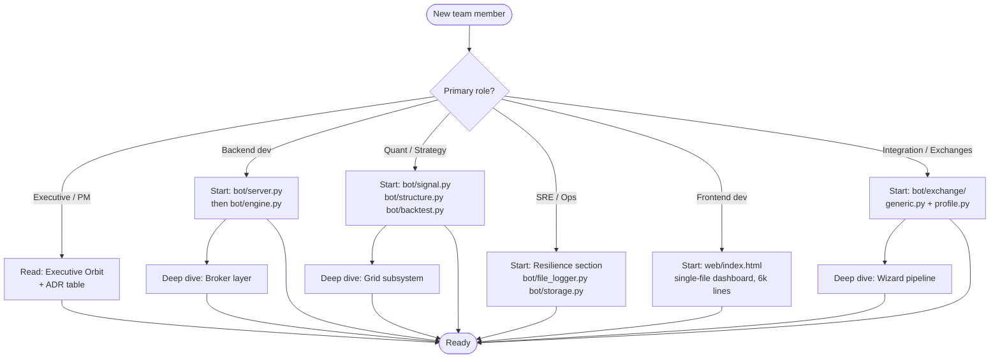
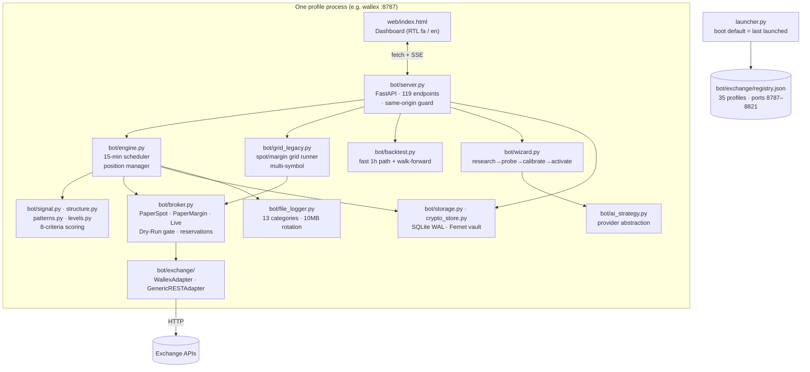
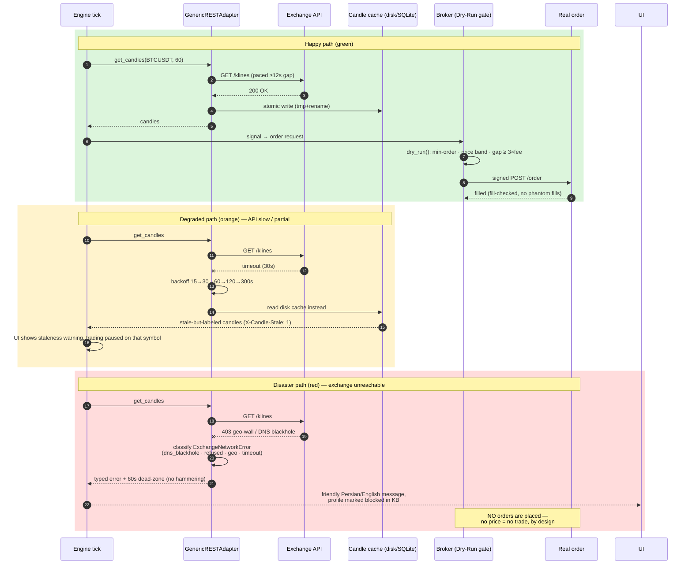

# Any WALLEX — Multi-Exchange Algorithmic Trading Platform


> ⚠️ **Risk disclosure — read first.** This software places real orders when live mode is explicitly enabled. It does **not** guarantee profit. Crypto trading is high-risk and you can lose your entire capital. The default and recommended mode is **Paper Trading** (full simulation, zero real orders).

---

## 1. The Executive Orbit (Vision & Metrics)

**Elevator pitch.**
Any WALLEX turns a single Wallex-only trading bot into a self-onboarding, multi-exchange algorithmic trading platform — one Persian/English dashboard, one engine, N exchange profiles — while keeping paper-mode-by-default safety and full local data ownership.

**Business impact matrix.**

| Dimension | Legacy state (Wallex-only bot) | Any WALLEX platform | Impact |
|---|---|---|---|
| Exchange coverage | 1 exchange, hard-coded client | **35 registered profiles** (Wallex, Nobitex, MEXC, KuCoin, Bybit, Kraken, Hyperliquid, EdgeX, …) via a generic profile interpreter | Weeks of per-exchange dev work → hours of profile onboarding |
| Onboarding cost | Manual endpoint research, code changes per exchange | **AI setup wizard** researches → probes → calibrates → activates a profile end-to-end, and heals broken profiles | Near-zero marginal cost per new exchange |
| Time-to-insight | Manual JSON/API fiddling to validate an exchange | **7-point live probe** with a pass/fail report and recorded limitations | Honest go/no-go in minutes |
| Operational safety | Live mode reachable in one click | **Dry-Run gate** on every live order, kill-switch env, same-origin guard, encrypted credential vault | Risk of accidental live orders ≈ 0 |
| Data ownership | — | All state in **local SQLite + JSON**, per-profile isolation | No cloud dependency, no telemetry leaves the machine |

**Strategic single point of failure (transparent statement).**
The platform depends on the **exchange's public REST API for candle history**. If an exchange geo-blocks the host machine (common in Iran: 403 Cloudflare walls, DNS black-holing), that profile degrades to "markets-only" or "blocked" status. This is documented per profile — not hidden. The engine keeps running for reachable profiles.

---

## 2. The Cognitive Map (Navigation)



**What this means for you:** pick your row, read two files, and you are productive. Everything else is optional depth.

---

## 3. Architectural Decision Records (Summarized)

| Context | Decision | Alternatives considered | Consequences |
|---|---|---|---|
| N exchanges, one codebase | **Generic profile interpreter** (`bot/exchange/generic.py`) driven by per-profile JSON | (a) hand-coded adapter per exchange; (b) third-party CCXT | ✅ new exchange = JSON only, no deploy · ✅ per-exchange quirks recorded as data · ❌ complex endpoints (nested POST bodies, numeric contract IDs) need interpreter features |
| Frontend | **Single-file `web/index.html`** (~6,100 lines), no build step | React/Vite SPA | ✅ zero toolchain, instant edit-reload · ✅ served by the same process · ❌ large file discipline required |
| Live-order safety | **Dry-Run gate** inside the broker before every real order | exchange-side confirmations only | ✅ min-order/price-band/fee-gap checks enforced uniformly · ❌ one extra code path to maintain per order type |
| Credentials | **Fernet-encrypted local vault** (`bot/crypto_store.py`), PBKDF2 key from `WALLEX_KEY_PASSWORD` | plaintext JSON; OS keychain | ✅ keys never leave the machine, encrypted at rest · ❌ password lost = keys unrecoverable |
| Local DB | **SQLite (WAL mode) + JSON snapshots**, atomic writes everywhere | Postgres; pure JSON | ✅ zero-ops, per-profile file isolation · ❌ single-writer; not for multi-host deployments |
| Rate limiting | **Client-side pacing slot** (min API gap), wait outside the lock | naive sleep-in-lock | ✅ UI never starves behind engine fetches · ❌ slightly more complex throttle |
| Language | **Python 3.11 + FastAPI + uvicorn** | Node.js, Go | ✅ quant/indicator ecosystem · ❌ GIL — mitigated by detached per-profile OS processes |
| Multi-profile isolation | **One OS process per exchange profile**, registry assigns ports 8787–8821 | multi-tenant single process | ✅ crash isolation, independent restarts · ❌ more RAM at 35 profiles |

---

## 4. System Topology (C4 Model)

### Level 1 — System Context

```mermaid
flowchart LR
    U([👤 Trader]) -->|browser, fa/en| S
    AI([🤖 LLM provider<br/>local Ollama / cloud API]) -.->|strategy research<br/>& diagnosis| S
    S{{"Any WALLEX Platform<br/>(per-profile process)"}}
    EX([🏦 Exchange REST API<br/>Wallex / MEXC / KuCoin / …]) -->|candles, markets,<br/>balances, orders| S
    S -->|signed orders<br/>(live mode only)| EX
    S -->|SQLite + JSON<br/>all local| DB[(💾 Local data store)]
```

**What this means for you:** the platform talks to exactly three external things — your browser, your chosen LLM (optional), and the exchange. Everything else stays on your disk.

### Level 2 — Container diagram



**What this means for you:** every exchange profile is its own OS process with its own database slice. A crashed MEXC profile cannot take down Wallex.

### Level 3 — Critical path: candle fetch & order placement



**What this means for you:** the bot never trades on unknown prices. If the exchange is down or blocked, it degrades to read-only with a clear message instead of guessing.

---

## 5. The Zero-Trust Getting Started Guide

### Prerequisites

- **Python 3.11+** (developed and tested on 3.11 / 3.13)
- **Windows** (primary target — `run.bat`, detached per-profile processes) — Linux/macOS work for the server itself
- ~200 MB disk per active profile (SQLite + candle caches + rotated logs)

Verify your Python checksum before install (official hashes: https://www.python.org/downloads/):

```bash
# PowerShell — compare against the hash published on python.org
Get-FileHash python-3.11.9-amd64.exe -Algorithm SHA256
```

### Install

```bash
git clone <your-repo-url> "Any WALLEX"
cd "Any WALLEX"
python -m venv .venv
# Windows
.venv\Scripts\activate
pip install -r requirements.txt
```

### Environment configuration

All secrets are optional and encrypted at rest. Validate intent with this schema (the app itself reads these via `os.environ`):

```yaml
# env.schema.yaml — every variable the platform understands
env:
  WALLEX_KEY_PASSWORD:
    type: string
    required: false
    description: >
      Master password for the Fernet credential vault. If unset, a random
      password is generated once and persisted to .key_password (local only).
    example: "correct-horse-battery-staple"
  WALLEX_LIVE_ALLOWED:
    type: string
    enum: [yes, no]
    default: "no"
    description: Master kill-switch. When "no", engaging live trading is refused.
  WALLEX_API_KEY:
    type: string
    secret: true
    description: Exchange API key (alternative to storing via the dashboard).
  WALLEX_API_SECRET:
    type: string
    secret: true
  BOT_PROFILE:
    type: string
    default: "wallex"
    description: Which registered exchange profile this process serves.
  BOT_CONFIG:
    type: string
    default: "config.yaml"
  BOT_DATA_DIR:
    type: string
    default: "data"
  PAPER_MODE:
    type: string
    enum: ["1", "0"]
    default: "1"
  AI_PROVIDER:
    type: string
    enum: [openai, openrouter, custom, ollama, lmstudio, llamafile]
    description: LLM used by the setup wizard / strategy generator. Optional.
  AI_BASE_URL:
    type: string
    example: "https://api.example.com/v1"
  AI_MODEL:
    type: string
    example: "qwen2.5:14b"
  AI_API_KEY:
    type: string
    secret: true
  AI_TIMEOUT:
    type: integer
    default: 120
  AI_MAX_TOKENS:
    type: integer
    default: 4096
  AI_RETRIES:
    type: integer
    default: 2
  QA_BASE_URL:
    type: string
    default: "http://127.0.0.1:8787"
    description: Target dashboard URL for the QA monitor script (scripts/qa_monitor.py).
```

### Run

```bash
# Interactive launcher — pick profile, port, open dashboard
python launcher.py

# Direct boot of a specific profile
python launcher.py --profile nobitex --port 8789

# List all registered profiles + ports
python launcher.py --list

# Stop everything (warns about running workflows/grids)
python stop.bat        # Windows
python stop_all.py     # cross-platform
```

The dashboard opens automatically at `http://127.0.0.1:<port>/`.
First boot shows the **onboarding wizard** — keep the default Wallex paper profile or set up any other exchange.

### Reproducible multi-profile local stack

The platform already runs one **process per profile**; emulate a scaled farm locally:

```bash
# three detached profiles on separate ports (the launcher kills only its own port)
start "" /B python launcher.py --profile wallex  --port 8787
start "" /B python launcher.py --profile mexc    --port 8790
start "" /B python launcher.py --profile kucoin  --port 8793
```

**What this means for you:** each profile is isolated at the OS level — crash, restart, or stop one without touching the others. The in-app profile switcher boots any profile's backend on demand and opens its dashboard.

### Seed data (realistic, not "test1/test2")

```bash
python -c "import random, math, sys; sys.path.insert(0,'.'); from tests.conftest import uptrend_candles, downtrend_candles; from bot.models import Candle; rows=uptrend_candles(120)+downtrend_candles(120); print(f'{len(rows)} synthetic candles: mean={sum(c.c for c in rows)/len(rows):.2f}, last={rows[-1].c}')"
```

Or simply run **Quick Scan** in the dashboard — the engine fetches real candles and backfills its caches from the exchange.

---

## 6. API Surface & Telemetry (Reference)

119 REST endpoints under `/api/*` (FastAPI, OpenAPI schema at `/docs`). Highlights:

### REST examples

```bash
# health
curl -s http://127.0.0.1:8787/api/status

# engine opportunities (8-criteria scored)
curl -s http://127.0.0.1:8787/api/opportunities

# candles (15m), with staleness headers
curl -si "http://127.0.0.1:8787/api/candles/BTCUSDT?resolution=15&limit=200" | head -20

# create + start a paper spot grid
curl -s -X POST http://127.0.0.1:8787/api/grids \
  -H "Content-Type: application/json" \
  -d '{"name":"demo","symbol":"BTCUSDT","mode":"spot","direction":"long",
       "range_min":60000,"range_max":70000,"grid_count":20,"spacing":"arithmetic",
       "total_quote":1000,"allocation":"even","activation_mode":"now"}'

curl -s -X POST http://127.0.0.1:8787/api/grids/<GRID_ID>/start -H "Content-Type: application/json" -d '{}'

# live holdings ("Holding pair" view)
curl -s http://127.0.0.1:8787/api/holdings
```

### Observability contract

The platform logs **structured JSON lines** per category, per profile, with 10 MB rotation:

```
Logs/<pid>/api.jsonl        every exchange call: url, status, ms
Logs/<pid>/decisions.jsonl  why a signal fired (all 8 criteria, per candle)
Logs/<pid>/orders.jsonl     manual + grid orders with fill results
Logs/<pid>/errors.jsonl     adapter exceptions with classification
Logs/<pid>/balance.jsonl    equity snapshots
Logs/<pid>/wizard.jsonl     AI research/probe/activation steps
```

Sample record (`api.jsonl`):

```json
{"ts": "2026-09-11T03:12:23.385Z", "cat": "api", "url": "https://api.wallex.ir/v1/udf/history?symbol=BTCUSDT&resolution=60", "status": 200, "ms": 412, "profile": "wallex"}
```

Correlation: every dashboard action flows through `server.py` which tags log lines with the profile and category; because each profile has its own `Logs/<pid>/` tree, tracing a request = reading one directory. Staleness travels to the browser via the `X-Candle-Stale: 1` response header (plus `X-Candle-Fetch-Error` with the reason).

### Error catalog

| Condition | Where raised | User-visible behavior | Remediation |
|---|---|---|---|
| `ExchangeNetworkError(dns_blackhole)` | adapter | «این صرافی از شبکه شما در دسترس نیست» + 60 s dead-zone | VPN / different host; profile stays registered |
| `ExchangeNetworkError(geo)` | adapter (403 wall) | profile marked blocked in knowledge library | none (honest limitation) |
| `ExchangeNetworkError(refused)` | adapter | friendly message, no retry storm | check exchange status page |
| Live order rejected by Dry-Run gate | broker | order blocked, reason logged (`last_reject`) | fix qty / price band / grid fee-gap ≥ 3×fee |
| `finish_reason=length` from LLM | wizard | output-budget rules re-prompt; truncation detected | smaller model context or shorter prompt |
| OpenRouter management key (401 `User not found`) | ai_strategy | «این کلید از نوع Management است…» rejected at save | create a normal API key |
| Grid fee-gap < 3× taker fee | preview | amber warning + one-click fix buttons | widen range or reduce level count |
| Grid deleted while running | `/api/grids/{id}` | HTTP 400 «گرید در حال اجراست» | stop first |
| Factory reset in live mode | `/api/reset-all` | **partial account-safe reset** (see §7) | — |

---

## 7. Resilience Engineering (The "Fire Drill" Section)

| Fault injected | Detected by | System behavior | Recovery |
|---|---|---|---|
| **Network partition** to one exchange | adapter timeout classification | typed `ExchangeNetworkError`, 60 s dead-zone per resource, backoff ladder 15/30/60/120/300 s; candle cache served with staleness header; **no orders on unknown prices** | automatic when exchange answers |
| **Geo-block / DNS blackhole** (10.10.x.x censor answers) | DNS resolves to private IP | profile classified blocked, knowledge library records the limitation with timestamp; other profiles unaffected | VPN or different host |
| **Exchange API latency spike** | client pacing + fill checks | pacing slot reservation (no lock convoy); UI endpoints serve from 45 s markets snapshot (warm ≈ 0 ms); grid ticks skip when engine tick-lock is held | automatic |
| **Process kill mid-write** | atomic write pattern | every state file (`tmp + os.replace`), SQLite WAL — corrupt files are preserved as `.corrupt`, never silently wiped | restart; state re-reads last good file |
| **Paper→live broker swap** | `_engage_live` | paper positions are cleared + snapshotted (no phantom real orders), live margin syncs from the exchange | automatic |
| **Factory reset in live mode** | `/api/reset-all` guard | **partial account-safe reset**: keeps trade-mode checkpoint, API keys, running grids, real-order manual records; wipes only local analytics (trades/equity/events/api_log) | — |
| **Backend closed while workflows run** | `stop.bat` / `stop_all.py` | warns about active grids/strategies; **hybrid restore** re-resumes running grids on next boot | automatic |
| **Profile switch** | launcher | detached OS process per profile — switching never stops running workflows on other profiles | — |
| **LLM cold-start / unreachable** | wizard + doctor | all AI features degrade to manual entry with a Persian message; trading never depends on AI | add provider in settings |

### Circuit-breaker configuration (client pacing)

| Parameter | Value | Where |
|---|---|---|
| Min gap between exchange calls | `api_min_gap_sec: 12` (per profile, config.yaml) | engine pacing slot |
| Max retries per request | `api_max_retries: 3` | adapter |
| Retry pause | `api_retry_pause_sec: 30` exponential to 300 s | adapter |
| Error dead-zone | 60 s per resource after hard failure | engine `_fetch_err` |
| Live kill-switch | `WALLEX_LIVE_ALLOWED=no` refuses engagement | server |
| Grid fee-gap breaker | level gap must be ≥ 3× taker fee before start | grid preview |

**What this means for you:** the platform fails loud, local, and safe — it would rather pause trading than place an order on stale or unknown prices.

---

## 8. Testing Pyramid & Quality Gates

```
        ╱╲
       ╱  ╲      108 unit tests (< 1 s) — signals, risk, grid,
      ╱ 108 ╲     adapters, wizard parsing, quote math
     ╱──────╲
    ║ Integration ║  TestClient against create_app(): holdings,
    ║  (in-suite) ║  factory reset (paper + live paths), endpoints
   ╱──────────────╲
  ║  Live probe     ║  per-exchange 7-point probe (markets, candles,
  ║  (manual/wizard)║  depth, ticker, server-time) — recorded in KB
 ╱────────────────────╲
║  Backtest validation  ║  no look-ahead bias; shorts routed by
║  (backtest.py)        ║  direction; maintenance per candle
```

```bash
# full suite (must stay green — baseline 108 passed)
python -m pytest tests/ -q

# single domain
python -m pytest tests/test_grid_legacy.py -v

# contract sanity
python -m pytest tests/test_wallex_rules.py tests/test_risk.py -v
```

**Quality gates for every change:**
1. Full suite green (108 tests, ≤ 1 s).
2. `py_compile` clean on touched Python files.
3. Main `<script>` block parses (`node vm.Script`) after any `index.html` edit.
4. Behavior verified through the real `create_app` (TestClient) or a live boot — never "should work".
5. New exchange profiles require a **passing 7-point live probe** — AI guesses are never accepted.

---

## 9. Glossary of Domain Jargon

| Term | Definition |
|---|---|
| **Paper trading** | Full market simulation with virtual capital — identical code path to live, but orders hit the local broker, never the exchange. Default mode. |
| **Dry-Run gate** | The broker-side pre-flight check every live order must pass (min notional, price band, fee-gap rule). Blocks the order locally before it can reach the exchange. |
| **Grid strategy** | Buy-low/sell-high ladder of N price levels between a range. Spot grids hold real assets; margin grids use leveraged loans (long/short/neutral). |
| **BOS / CHoCH** | *Break of Structure* / *Change of Character* — swing-structure events from the 4 h timeframe used as trend context for the 1 h entry. |
| **Risk/Reward (RR)** | Reward-to-risk ratio of a setup. Entry requires ≥ 1.5; stop moves to breakeven at 1.5; 50 % partial close at 2.5 (configurable). |
| **Walk-forward** | Rolling out-of-sample backtest (train on window N, test on N+1) — guards against overfit strategy parameters. |
| **Knowledge library** | Per-exchange JSON record (`data/profiles/exchange_knowledge.json`) with every config correction stored as a timestamped diff — the platform's institutional memory. |
| **Hybrid restore** | On boot, the platform re-resumes grids/strategies that were running when the process died. |
| **Reservation** | Capital a running grid locks on the broker so other strategies cannot spend it; released on stop. |
| **Profile** | One exchange configuration (endpoints, auth, quote families, symbol map) stored as `data/profiles/<id>/profile.json` + a detached OS process on its own port. |

---

## Project layout

```
Any WALLEX/
├── launcher.py               interactive boot: profile picker, ports 8787–8821
├── run.bat / stop.bat        Windows entry points (stop warns about workflows)
├── config.yaml               every strategy threshold, in Persian comments
├── requirements.txt          fastapi · uvicorn · httpx · cryptography · pytest
├── bot/
│   ├── server.py             FastAPI app — 119 endpoints, static dashboard,
│   │                         same-origin guard, per-profile wiring
│   ├── engine.py             15-min scheduler, closed-candle-only ticks,
│   │                         candle disk cache (atomic), tick reentrancy guard
│   ├── signal.py             8-criteria weighted scoring + critical gates
│   ├── structure.py          HH/HL/LH/LL · BOS · CHoCH (4 h structure)
│   ├── patterns.py           Engulfing · Pin Bar · Hammer · Morning Star
│   ├── levels.py             S/R, Order Blocks, FVG
│   ├── indicators.py         RSI · ATR · EMA · SMA · volume ratio
│   ├── risk.py               position sizing · drawdown ladder · trailing
│   ├── broker.py             Paper spot/margin + Live broker, Dry-Run gate,
│   │                         capital reservations, liquidation engine
│   ├── grid_legacy.py        grid runner + manager (spot & margin, multi-symbol)
│   ├── manual_orders.py      market/limit/stop + TP/SL simulation
│   ├── backtest.py           fast path + walk-forward, no look-ahead
│   ├── wizard.py             AI research → probe → calibrate → activate
│   ├── ai_strategy.py        LLM provider abstraction + strategy generation
│   ├── exchange/             registry · profile loader · WallexAdapter ·
│   │                         GenericRESTAdapter · factory
│   ├── storage.py            SQLite WAL: trades/equity/events/kv/manual_orders
│   ├── crypto_store.py       Fernet-encrypted API-key vault (PBKDF2)
│   ├── quotes.py             TMN/USDT cross-exchange conversion rates
│   ├── cmc_service.py        CoinMarketCap context strip (optional)
│   ├── doctor.py             AI-assisted diagnosis of broken setups
│   └── file_logger.py        13 JSONL categories with rotation
├── web/index.html            the entire dashboard (single file, fa/en)
├── data/profiles/<id>/       per-profile DB, grids.json, profile.json, logs
├── data/profiles/registry.json      35 profiles · last-launched boot default
├── data/profiles/exchange_knowledge.json   KB with timestamped diff history
├── scripts/batch_setup_exchanges.py  resumable mass-profile setup tool
└── tests/                    108 tests across 14 files
```

---

## Contributing

1. Read the **Cognitive Map** for your role; skim the ADR table so you don't re-litigate settled decisions.
2. Make the change; run the full suite; verify behavior through `create_app` or a live boot — a claim without a verified run is not done.
3. For new exchange support: add the profile JSON, run the wizard probe, and record every endpoint correction in the knowledge library — the next person relies on it.
4. Never commit secrets, real API keys, or `data/profiles/*/bot.db`.

## License

Private project — all rights reserved by the repository owner.
